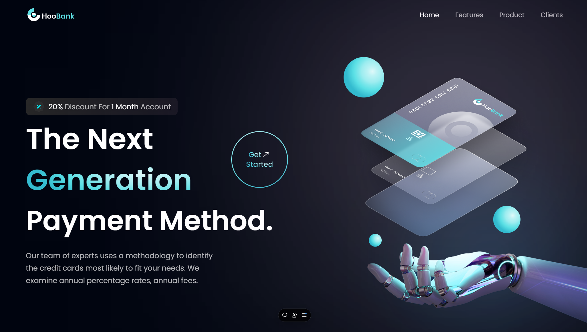

# 💳 HooBank 


HooBank is a UI/UX-focused modern fintech website designed to showcase financial services and solutions. Built with **React.js** and **Tailwind CSS**, it delivers a responsive, visually appealing, and seamless user experience across all devices.

**🌐 Explore HooBank in action :** [Live Demo](https://itshoobank.vercel.app)

## ✨ Features / Highlights

- **📱 Responsive Design**: Fully optimized for various screen sizes, including desktops, tablets, and smartphones.
- **🎨 Modern UI/UX**: Sleek and contemporary design elements to enhance the user experience.
- **🧩 Reusable Components**: Modular React components that are easy to maintain and extend.
- **🎬 Custom Animations**: Subtle animations to add a dynamic feel to the user interface.
- **🌬️ Tailwind CSS Styling**: Rapid UI development with utility-first CSS.

## 🚀 Tech Stack

- ⚛️ **Frontend:** React.js, JavaScript (ES6+), HTML5, CSS3
- 🎨 **Styling:** Tailwind CSS
- ✨ **UI/UX:** Responsive & Modern Design
- ⚡ **Deployment:** Vercel



## 🛠️ Setup & Installation

To run HooBank locally, follow these steps:

### 1️⃣ Clone the Repository

```bash
git clone https://github.com/deepanshu1420/HooBank.git
```

### 2️⃣ Navigate to the Project Directory

```bash
cd HooBank
```

### 3️⃣ Install Dependencies

```bash
npm install
```

### 4️⃣ Start the Development Server

```bash
npm run dev
```

### 5️⃣ Open in Browser and Visit

```text
http://localhost:5173
```

Your application should now be running locally on your machine. ☄️


